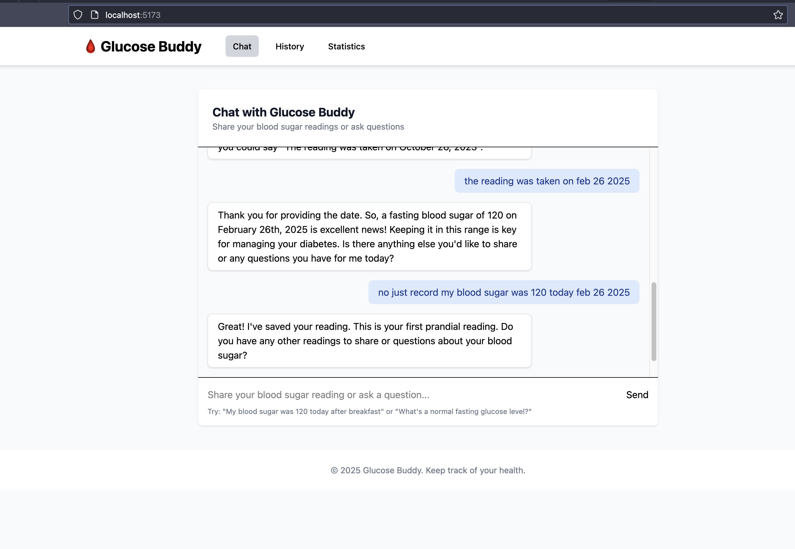

# 🩸 Glucose Buddy

A modern, AI-powered blood glucose tracking application with a conversational interface. Track your readings through natural language and gain insights into your health trends.



## Overview

Glucose Buddy is designed to make blood glucose tracking more intuitive and user-friendly. Instead of manually entering numbers into forms, simply tell the app about your reading in natural language, and the AI will extract and record the important details.

This motivation for this is that you could build onto this agentic workflow and be able to increase or decrease medications without needing to see a doctor.

## ✨ Features

- **Natural Language Input**: Enter readings conversationally (e.g., "My sugar was 120 today after breakfast")
- **AI-Powered Extraction**: Automatically identifies glucose levels, dates, and meal status
- **Real-Time Conversation**: Chat with the AI assistant about your readings and health
- **Trend Analysis**: Get insights about how your current readings compare to previous ones
- **History Tracking**: View all your past readings in a clean, organized table
- **Statistics Dashboard**: Visualize your averages and trends for both fasting and post-meal readings
- **Real-Time Updates**: WebSocket connection ensures instant feedback and updates

## 🛠️ Tech Stack

### Backend

- **FastAPI**: High-performance Python web framework
- **WebSockets**: Real-time bi-directional communication
- **Pydantic**: Data validation and settings management
- **Gemini AI Model**: Natural language processing for extracting glucose readings

### Frontend

- **SvelteKit**: Modern, efficient frontend framework
- **Tailwind CSS**: Utility-first CSS framework
- **TypeScript**: Type-safe JavaScript
- **WebSockets**: Real-time communication with backend

## 🏗️ Architecture

The application follows a client-server architecture with real-time communication:

1. **Frontend** (SvelteKit):

   - Manages UI state and user interactions
   - Communicates with backend via WebSockets
   - Renders responsive views for different devices

2. **Backend** (FastAPI):

   - Processes natural language input using AI
   - Extracts and validates glucose readings
   - Stores readings and calculates statistics
   - Provides trend analysis
   - Streams updates to the frontend

3. **AI Components**:
   - Conversation Agent: Handles natural dialogue
   - Extraction Agent: Identifies glucose readings from text
   - Validation: Ensures readings are within valid ranges

## 📋 Prerequisites

- **Python 3.12+**
- [**Node.js 16+**](https://nodejs.org/en/download)
- [**bun**](https://bun.sh/docs/installation)
- [**Gemini API Key** (for AI functionality)](https://aistudio.google.com/)

## 🚀 Getting Started

### Backend Setup

1. Clone the repository:

   ```bash
   git clone https://github.com/yourusername/glucose-buddy.git
   cd glucose-buddy
   ```

2. Create a virtual environment:

   ```bash
   python -m venv venv
   source venv/bin/activate  # On Windows: venv\Scripts\activate
   ```

3. Install backend dependencies:

   ```bash
   pip install -r requirements.txt
   ```

4. Create a `.env` file with your API keys:

You can get a free gemini key from here: https://aistudio.google.com/

```
GEMINI_API_KEY=your_key
LOGFIRE_API_KEY=your_logfire_key_if_needed
```

5. Start the backend server:
   ```bash
   cd backend
   uvicorn main:app --reload
   ```
   The server will be available at `http://localhost:8000`

### Frontend Setup

1. Navigate to the frontend directory:

   ```bash
    cd client/glucose_doc_client
   ```

2. Install dependencies:

   ```bash
   bun install
   ```

3. Start the development server:

   ```bash
   bun run dev
   ```

4. Open your browser to `http://localhost:5173`

## 📱 Usage

### Recording a Blood Sugar Reading

I'm still troubleshooting a why using "today" is not working well but if you mention the date of Feb 25, 2025 it seems to help the agent. 🙂

1. Type a message like: "My blood sugar was 120 mg/dL this morning while fasting"
2. The AI will extract the:
   - Glucose level (120 mg/dL)
   - Date (today)
   - Meal status (fasting)
3. Confirm the reading or correct any misinterpreted information
4. Add optional notes about factors that might have affected your reading
5. The reading will be saved and you'll receive trend analysis

### Viewing History and Statistics

- Click on the "History" tab to see all your past readings in a table
- Click on the "Statistics" tab to view:
  - Average readings for fasting and after meals
  - Latest readings
  - Total readings count
  - Normal range information

## 📁 Project Structure

```
glucose-buddy/
├── backend/                   # FastAPI server
│   ├── main.py                # WebSocket server and API
│   └── requirements.txt       # Python dependencies
├── frontend/                  # SvelteKit frontend
│   ├── src/
│   │   ├── routes/            # Page components
│   │   ├── lib/               # Shared components and utilities
│   │   │   ├── components/    # Reusable UI components
│   │   │   └── stores/        # State management
│   │   └── app.css            # Global styles
│   ├── static/                # Static assets
│   ├── svelte.config.js       # Svelte configuration
│   ├── tailwind.config.js     # Tailwind CSS configuration
│   └── package.json           # Node dependencies
└── README.md                  # This file
```

## 🔜 Future Improvements

- **Work with a doctor service to intelligently alter your prescription**
- **Data Export**: Export readings as CSV or PDF
- **Medication Tracking**: Record insulin or medication doses
- **Meal Logging**: Detailed food intake recording
- **Goal Setting**: Set and track target glucose ranges
- **Notifications**: Reminders to check blood sugar
- **Multi-user Support**: Family accounts with shared access
- **Mobile App**: Native mobile application

## 🙏 Acknowledgements

- [FastAPI](https://fastapi.tiangolo.com/)
- [SvelteKit](https://kit.svelte.dev/)
- [Tailwind CSS](https://tailwindcss.com/)
- [Gemini AI](https://ai.google.dev/gemini-api)

---

Made with ❤️ for better diabetes management
