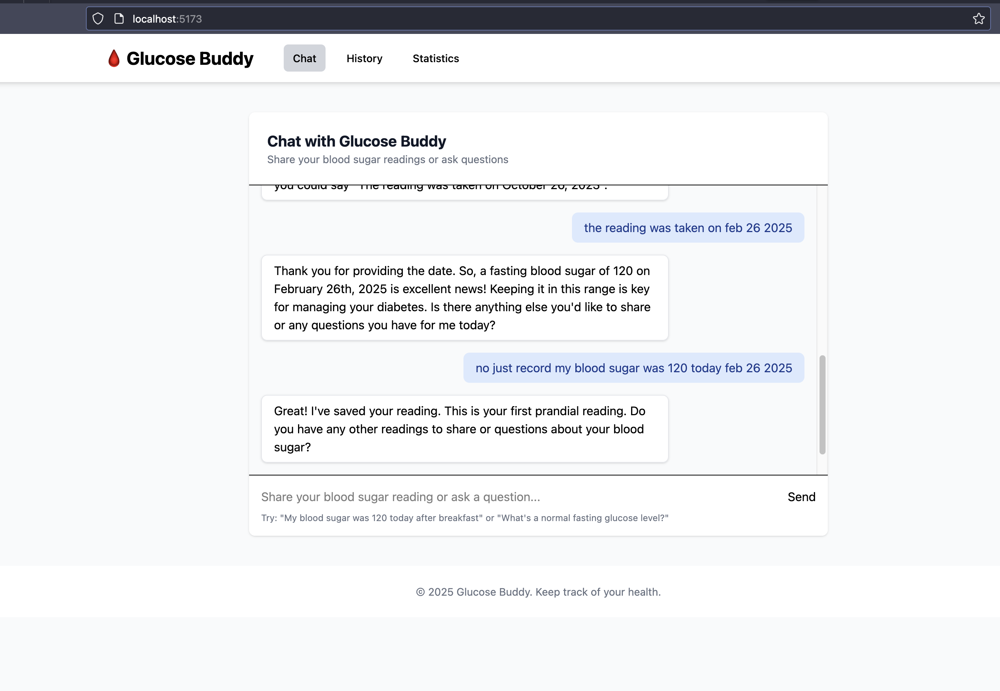
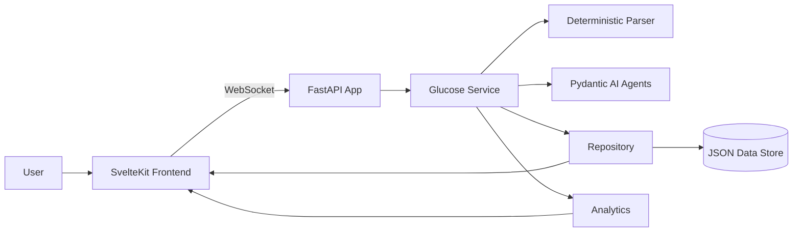

<p align="center">
  
</p>

<p align="center">
  
</p>

<h1 align="center">Glucose Buddy</h1>

<p align="center">
  A conversational health app built to feel like a real product, not an AI toy.
</p>

<p align="center">
  Natural-language glucose logging. Deterministic extraction and validation. Polished Svelte UI. Production-oriented containers.
</p>

---

<p align="center">
  <strong>Built by Johnny de Vriese</strong><br />
  Full-stack product engineer focused on thoughtful UX, pragmatic AI systems, and production-quality execution.
</p>

<p align="center">
  <a href="https://www.linkedin.com/in/johnny-devriese-080556129/">LinkedIn</a>
  ·
  <a href="https://johnnydevriese.github.io/">Blog</a>
  ·
  <a href="https://johnnydevriese.github.io/#glucose-buddy">Project Write-Up</a>
</p>

## Built To Impress

Glucose Buddy is a portfolio project designed to show how I think as a product-minded engineer.

This is not just a chatbot taped onto a form. It is a full-stack application that turns natural language like `"my blood sugar was 118 today fasting"` into a validated, saveable reading with confirmation, persistent history, stats, and a visual experience that feels considered instead of generic.

The point of this repo is to demonstrate that I can:

- turn a rough prototype into a structured application
- combine AI features with deterministic engineering where reliability matters
- design and build both backend architecture and frontend experience
- modernize tooling, packaging, and deployment end to end
- ship something that looks good, works, and can actually run

## Why It Stands Out

- The app uses AI where it helps, but the critical logging workflow does not depend entirely on model luck.
- The UI was deliberately redesigned to feel warm, premium, and product-level rather than like a default starter template.
- The stack was upgraded and productionized: Python 3.10+, `uv`, `taskipy`, Svelte 5, SvelteKit 2, Bun, and Docker Compose.
- The frontend now ships as a compiled Node app in a multi-stage production image rather than a dev server in a container.

## What I Built

- Refactored the backend from a prototype into a package with clear responsibilities for settings, schemas, parsing, analytics, persistence, and orchestration
- Built a deterministic-first glucose capture flow, then layered Pydantic AI on top for classification and conversational help
- Redesigned the frontend into a more polished application shell with a warmer visual language and clearer information hierarchy
- Upgraded the frontend to a current Svelte 5 and SvelteKit 2 stack, then fixed the surrounding build and config issues
- Added a production-oriented Docker setup for both services instead of stopping at local dev scripts
- Added CI so the repo advertises repeatability, not just code volume

## What The Product Does

- Log blood sugar readings in natural language
- Extract glucose value, date, and fasting vs. after-meal context
- Confirm readings before they are saved
- Persist reading history
- Show summary stats for fasting and prandial readings
- Support both local development and containerized startup

## Product Screens

The README now leads with two different views on purpose:

- a full product shot to show the overall visual system
- a tighter chat capture to show the sticky header, conversational flow, and interaction quality in one frame

## Architecture


```mermaid
flowchart LR
    U[User] --> F[SvelteKit Frontend]
    F -->|WebSocket| A[FastAPI App]
    A --> S[Glucose Service]
    S --> P[Deterministic Parser]
    S --> G[Pydantic AI Agents]
    S --> R[Repository]
    R --> D[(JSON Data Store)]
    S --> T[Analytics]
    T --> F
    R --> F
```

### Backend

The backend was refactored from a single-file prototype into a proper internal package with clear boundaries:

- [`backend/glucose_agent/settings.py`](/Users/johnnydevriese/projects/glucose_doc/backend/glucose_agent/settings.py)
- [`backend/glucose_agent/schemas.py`](/Users/johnnydevriese/projects/glucose_doc/backend/glucose_agent/schemas.py)
- [`backend/glucose_agent/parser.py`](/Users/johnnydevriese/projects/glucose_doc/backend/glucose_agent/parser.py)
- [`backend/glucose_agent/analytics.py`](/Users/johnnydevriese/projects/glucose_doc/backend/glucose_agent/analytics.py)
- [`backend/glucose_agent/repository.py`](/Users/johnnydevriese/projects/glucose_doc/backend/glucose_agent/repository.py)
- [`backend/glucose_agent/service.py`](/Users/johnnydevriese/projects/glucose_doc/backend/glucose_agent/service.py)
- [`backend/glucose_agent/agents.py`](/Users/johnnydevriese/projects/glucose_doc/backend/glucose_agent/agents.py)

Key decision:

- deterministic parsing and validation first
- LLM-enhanced classification and conversation second

That tradeoff is intentional. In a healthcare-adjacent flow, consistency beats novelty.

### Frontend

The frontend was rebuilt to feel more like a product showcase than an internal tool:

- [`client/glucose_doc_client/src/routes/+layout.svelte`](/Users/johnnydevriese/projects/glucose_doc/client/glucose_doc_client/src/routes/+layout.svelte)
- [`client/glucose_doc_client/src/routes/+page.svelte`](/Users/johnnydevriese/projects/glucose_doc/client/glucose_doc_client/src/routes/+page.svelte)
- [`client/glucose_doc_client/src/routes/history/+page.svelte`](/Users/johnnydevriese/projects/glucose_doc/client/glucose_doc_client/src/routes/history/+page.svelte)
- [`client/glucose_doc_client/src/routes/stats/+page.svelte`](/Users/johnnydevriese/projects/glucose_doc/client/glucose_doc_client/src/routes/stats/+page.svelte)
- [`client/glucose_doc_client/src/app.css`](/Users/johnnydevriese/projects/glucose_doc/client/glucose_doc_client/src/app.css)

Highlights:

- upgraded to the current Svelte 5 toolchain in this repo
- redesigned app shell, chat, history, and stats views
- made WebSocket configuration container-safe
- switched deployment to `adapter-node` and a production server build

## Tooling And Delivery

This repo also shows the less glamorous but very important part of engineering: getting software into a reliable shape.

- Backend dependency management with [`uv`](/Users/johnnydevriese/projects/glucose_doc/backend/pyproject.toml)
- Task runner setup with `taskipy`
- Frontend dependency management with Bun
- Multi-container local environment with Docker Compose
- Production-oriented frontend image with a compiled SvelteKit server

Relevant files:

- [`backend/pyproject.toml`](/Users/johnnydevriese/projects/glucose_doc/backend/pyproject.toml)
- [`backend/Dockerfile`](/Users/johnnydevriese/projects/glucose_doc/backend/Dockerfile)
- [`client/glucose_doc_client/package.json`](/Users/johnnydevriese/projects/glucose_doc/client/glucose_doc_client/package.json)
- [`client/glucose_doc_client/Dockerfile`](/Users/johnnydevriese/projects/glucose_doc/client/glucose_doc_client/Dockerfile)
- [`docker-compose.yml`](/Users/johnnydevriese/projects/glucose_doc/docker-compose.yml)

## Verified

These commands were run successfully against the current codebase:

```bash
cd backend
uv run task test

cd client/glucose_doc_client
bun run check
bun run build

cd /path/to/glucose_doc
docker compose config
docker compose build
docker compose up -d --build
```

Verified outcomes:

- backend tests pass
- frontend checks pass
- frontend production build passes
- Docker images build successfully
- Docker Compose starts successfully
- backend health endpoint returns OK
- GitHub Actions CI now validates backend, frontend, and Docker build paths

## Stack

- Python 3.10+
- FastAPI
- Pydantic
- Pydantic AI
- `uv`
- `taskipy`
- Svelte 5
- SvelteKit 2
- Bun
- Tailwind CSS 4
- Docker Compose

## Run It

### Fastest Path

```bash
docker compose up --build
```

Services:

- frontend: `http://localhost:5173`
- backend: `http://localhost:8000`

### Local Development

Backend:

```bash
cd backend
uv venv --python 3.10
source .venv/bin/activate
uv sync --dev
uv run task dev
```

Frontend:

```bash
cd client/glucose_doc_client
bun install
bun run dev
```

### Environment

Minimum `.env` example:

```dotenv
GEMINI_API_KEY=your_google_ai_key
LOGFIRE_API_KEY=optional
```

If `GEMINI_API_KEY` is missing, the app still runs with deterministic behavior for the core flow.

## If You're Reviewing Me As A Candidate

This project is meant to signal a few things clearly:

- I care about product quality, not just technical correctness
- I can refactor architecture without losing momentum
- I know when to use AI and when not to trust AI
- I can own backend, frontend, tooling, and deployment in one repo
- I ship things that are both functional and presentable

If you want to reach me quickly:

- LinkedIn: <https://www.linkedin.com/in/johnny-devriese-080556129/>
- Blog: <https://johnnydevriese.github.io/>
- Glucose Buddy write-up: <https://johnnydevriese.github.io/#glucose-buddy>
